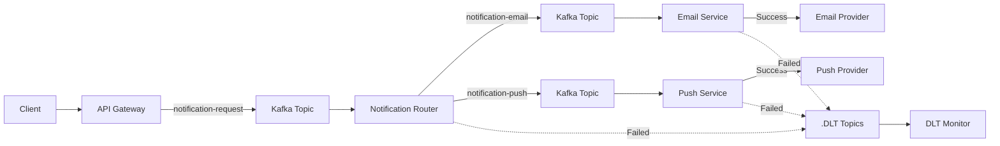

# Event-Driven Notification System

A sophisticated, microservices-based notification system built with **Spring Boot** and **Apache Kafka** that demonstrates modern event-driven architecture patterns. This system provides reliable, scalable, and traceable notification delivery across multiple channels including email and push notifications.


## Architecture Overview



## Core Concepts

### Event-Driven Architecture
- **Decoupled Communication**: Services communicate through events rather than direct calls
- **Asynchronous Processing**: Non-blocking message processing improves system responsiveness
- **Scalability**: Each service can scale independently based on load

### Kafka Core Concepts Used
- **Topics**: Messages are categorized into topics (`notification-request`, `notification-email`, `notification-push`)
- **Partitions**: Each topic has 3 partitions for parallel processing and load distribution
- **Consumer Groups**: Different services use different group IDs (`router-group`, `email-service-group`, `push-service-group`)
- **Message Keys**: Using `userId` as key ensures all messages for a user go to the same partition (ordering guarantee)
- **Dead Letter Queues**: Failed messages are routed to `.DLT` topics for monitoring

### Idempotency
- **Duplicate Prevention**: Redis-based caching prevents duplicate message processing
- **Message Deduplication**: Each message is processed only once regardless of retries
- **Consistency Guarantees**: Ensures reliable notification delivery without spam

### Distributed Tracing
- **Correlation IDs**: Unique identifiers track requests across all services
- **MDC (Mapped Diagnostic Context)**: Enhanced logging with request context
- **End-to-End Visibility**: Complete observability of message flow through the system

## Kafka Commands & Operations

### Topic Management
```bash
# List all topics
kafka-topics.sh --bootstrap-server localhost:9092 --list

# Describe topic configuration
kafka-topics.sh --bootstrap-server localhost:9092 --describe --topic notification-request

# Create topic manually (if needed)
kafka-topics.sh --bootstrap-server localhost:9092 --create --topic test-topic --partitions 3 --replication-factor 1

# Delete topic
kafka-topics.sh --bootstrap-server localhost:9092 --delete --topic test-topic
```

### Consumer Management
```bash
# List consumer groups
kafka-consumer-groups.sh --bootstrap-server localhost:9092 --list

# Describe consumer group details
kafka-consumer-groups.sh --bootstrap-server localhost:9092 --describe --group router-group

```

### Message Inspection
```bash
# Consume messages from topic (for debugging)
kafka-console-consumer.sh --bootstrap-server localhost:9092 --topic notification-request --from-beginning

# Produce test message
kafka-console-producer.sh --bootstrap-server localhost:9092 --topic notification-request
```

### Monitoring
```bash
# Check broker health
kafka-broker-api-versions.sh --bootstrap-server localhost:9092

# View log files
docker logs kafka
```

## System Components

### API Gateway (`api-gateway`)
**Entry point for all notification requests**

- **RESTful API**: HTTP endpoints for submitting notification requests
- **Request Validation**: Input validation and sanitization
- **Event Publishing**: Converts HTTP requests to Kafka events
- **Response Handling**: Provides immediate acknowledgment to clients

**Key Technologies**: Spring WebMVC, Spring Kafka, Jackson

### Notification Router (`notification-router`)
**Intelligent message routing and distribution**

- **Topic Routing**: Routes messages to appropriate service-specific topics
- **Event Transformation**: Enriches and transforms events for downstream services
- **Error Handling**: Comprehensive error handling with dead letter queue support
- **Load Balancing**: Distributes messages across available consumers

**Key Technologies**: Spring Kafka, Custom Error Handling, MDC Logging

### Email Service (`email-service`)
**Email notification processing and delivery**

- **Email Processing**: Handles email-specific notification logic
- **Idempotency Management**: Redis-based duplicate prevention
- **Template Support**: Supports email templating and personalization
- **Delivery Tracking**: Tracks email delivery status

**Key Technologies**: Spring Data Redis, Spring Kafka, Email Libraries

### Push Service (`push-service`)
**Push notification processing and delivery**

- **Push Processing**: Handles push notification logic for mobile/web clients
- **Device Management**: Manages device tokens and registration
- **Platform Integration**: Integrates with push notification providers (FCM, APNs)
- **Idempotency Management**: Prevents duplicate push notifications

**Key Technologies**: Spring Data Redis, Spring Kafka, Push SDKs

### DLT Monitor (`dlt-monitor`)
**Dead Letter Queue monitoring and alerting**

- **Failed Message Processing**: Monitors messages that failed processing
- **Alert System**: Sends alerts for critical failures
- **Recovery Mechanisms**: Provides tools for message recovery
- **Analytics**: Tracks failure patterns and system health

**Key Technologies**: Spring Kafka, Alerting Systems, Monitoring

### Notification Common (`notification-common`)
**Shared utilities and data structures**

- **Event Models**: Common event definitions and DTOs
- **Constants**: Shared constants for topics, error codes, etc.
- **Utilities**: Common utility functions across services
- **Validation**: Shared validation logic

**Key Technologies**: Jackson, Java 21

## Technology Stack

### Core Framework
- **Spring Boot 4.0.5**: Modern Java application framework
- **Java 21**: Latest Java LTS version with enhanced features
- **Maven**: Dependency management and build automation

### Messaging & Events
- **Apache Kafka 4.2.0**: Distributed streaming platform
- **Spring Kafka**: Kafka integration with Spring
- **JSON Serialization**: Jackson for message serialization

### Data Storage
- **Redis 8.6.2**: In-memory data store for caching and idempotency
- **Spring Data Redis**: Redis integration with Spring

### Monitoring & Observability
- **Prometheus**: Metrics collection and monitoring
- **Grafana**: Visualization and dashboarding
- **Spring Boot Actuator**: Application health and metrics
- **MDC Logging**: Structured logging with context

### Development Tools
- **Lombok**: Reduces boilerplate code
- **Spring Boot Test**: Comprehensive testing framework
- **Docker**: Containerization and orchestration

## Quick Start

### Prerequisites
- Java 21+
- Maven 3.8+
- Docker & Docker Compose

### 1. Start Infrastructure Services
```bash
cd infra
docker-compose up -d
```

This starts:
- Kafka (ports 9092, 19092)
- Redis (port 6379)
- Prometheus (port 9090)
- Grafana (port 3000)

### 2. Build All Services
```bash
# Build common library first
cd notification-common
mvn clean install

# Build all services
mvn clean install
```

### 3. Start Services
```bash
# Start each service in separate terminals
cd api-gateway && mvn spring-boot:run
cd notification-router && mvn spring-boot:run
cd email-service && mvn spring-boot:run
cd push-service && mvn spring-boot:run
cd dlt-monitor && mvn spring-boot:run
```

### 4. Send a Test Notification
```bash
curl -X POST http://localhost:8080/api/notifications \
  -H "Content-Type: application/json" \
  -d '{
    "userId": "user123",
    "type": "EMAIL",
    "recipient": "user@example.com",
    "subject": "Welcome!",
    "body": "Welcome to our platform!",
    "metadata": {
      "source": "registration",
      "priority": "high"
    }
  }'
```

## Monitoring & Observability

### Metrics Dashboard
- **Grafana**: Access at `http://localhost:3000`
- **Prometheus**: Access at `http://localhost:9090`
- **Health Checks**: Spring Actuator endpoints at `/actuator/health`

### Key Metrics
- Message throughput per service
- Error rates and failure patterns
- Consumer lag and processing times
- Redis cache hit rates
- JVM performance metrics


## Message Flow

1. **Request Submission**: Client sends HTTP request to API Gateway
2. **Event Creation**: API Gateway validates and creates `NotificationEvent`
3. **Kafka Publishing**: Event is published to `notification-request` topic
4. **Routing**: Notification Router consumes and routes to appropriate topic:
   - `notification-email` for email notifications
   - `notification-push` for push notifications
5. **Service Processing**: Target service processes the notification
6. **Idempotency Check**: Service checks Redis to prevent duplicates
7. **Delivery**: Notification is sent to external service (email provider, push service)
8. **Acknowledgment**: Message is acknowledged in Kafka
9. **Error Handling**: Failed messages go to DLT for monitoring

## Error Handling & Reliability

### Retry Mechanisms
- **Automatic Retries**: Configurable retry policies for transient failures
- **Exponential Backoff**: Prevents system overload during failures
- **Dead Letter Queue**: Failed messages are preserved for analysis

### Failure Monitoring
- **DLT Monitor**: Continuously monitors dead letter queues
- **Alert Integration**: Sends alerts for critical failures
- **Recovery Tools**: Manual and automatic message recovery

### Data Consistency
- **Transactional Processing**: Ensures message processing atomicity
- **Idempotency**: Guarantees exactly-once processing semantics
- **Acknowledgment Management**: Reliable message delivery confirmation

## Key Design Patterns

### Publisher-Subscriber Pattern
- Decouples message producers from consumers
- Enables flexible message routing and filtering
- Supports multiple consumers per message type

## Kafka Error Handling & Retry Patterns

### Exponential Backoff Strategy
```java
// From KafkaErrorConfig.java
ExponentialBackOff backOff = new ExponentialBackOff(1000L, 2.0); // 1s → 2s → 4s
backOff.setMaxElapsedTime(15000L); // Max 15 seconds total retry time
```

### Dead Letter Queue (DLQ) Pattern
- **Automatic DLT Creation**: Failed messages are automatically routed to `.DLT` topics
- **Non-Retryable Exceptions**: `DeserializationException` and `IllegalArgumentException` skip directly to DLT
- **DLT Monitoring**: `dlt-monitor` service watches `notification-email.DLT` and `notification-push.DLT`

### Manual Acknowledgment Pattern
```java
@KafkaListener(topics = KafkaTopics.NOTIFICATION_REQUEST, groupId = "router-group")
public void consume(NotificationEvent event, Acknowledgment ack) {
    try {
        // Process message
        routingProducer.route(event);
        ack.acknowledge(); // Manual acknowledgment
    } catch (Exception e) {
        // Will trigger retry mechanism
        throw e;
    }
}
```

### Message Ordering Guarantee
```java
// Using userId as key ensures ordering per user
kafkaTemplate.send(KafkaTopics.NOTIFICATION_REQUEST, event.getUserId(), event)
```

## Kafka Configuration Details

### Topic Configuration
```java
// From KafkaTopicConfig.java
@Bean
public NewTopic requestTopic() {
    return TopicBuilder.name(KafkaTopics.NOTIFICATION_REQUEST)
            .partitions(3)      // 3 partitions for parallel processing
            .replicas(1)        // 1 replica (single broker setup)
            .build();
}
```

### Docker Kafka Setup
```yaml
# From docker-compose.yml
kafka:
  image: apache/kafka:4.2.0
  environment:
    KAFKA_NODE_ID: 1
    KAFKA_PROCESS_ROLES: broker,controller
    KAFKA_AUTO_CREATE_TOPICS_ENABLE: "false"  # Topics created programmatically
```

